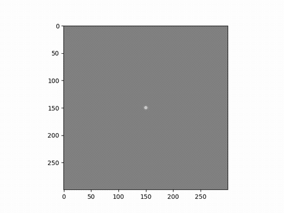
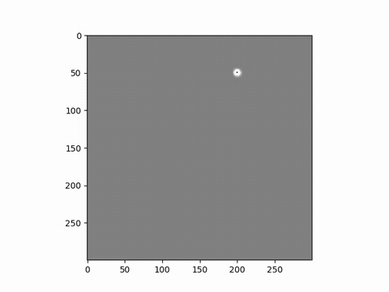
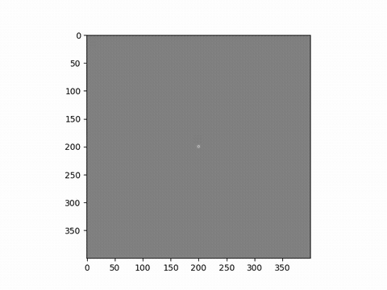

# Yee-algorithm

---

Numerical solution of Maxwell equations for monochromatic light using 2D Yee-net algorithm.

## Usage

```console
$: python3 fdtd.py #init params in fdtd.config
```

You can convert generated images from `result/` folder to:

```console
$: ffmpeg -i img_%o4d.png output.mp4 #MP4
$: ffmpeg -y -i output.mp4 -filter_complex "fps=5,scale=480:-1:flags=lanczos,split[s0][s1];[s0]palettegen=max_colors=32[p];[s1][p]paletteuse=dither=bayer" output.gif #GIF
```

## Examples

Due to huge GIF size framerate reduced to 5-10fps. Original *.mp4* files  in `examples` folder.








---

## MP4
https://user-images.githubusercontent.com/28964073/206905709-664b7adf-5819-4f55-b518-c347693333b5.mp4


https://user-images.githubusercontent.com/28964073/206905714-3bd27999-92e9-4154-bfce-d2cc53704ec4.mp4


https://user-images.githubusercontent.com/28964073/206905721-1e94a867-d35b-4973-803a-d748dcc9806c.mp4


https://user-images.githubusercontent.com/28964073/206905725-129a8d54-e9f8-4a0e-8ee0-ba9e1e1c3508.mp4


https://user-images.githubusercontent.com/28964073/206905730-69a2082e-097d-4943-be10-c4ba33d35a1e.mp4

